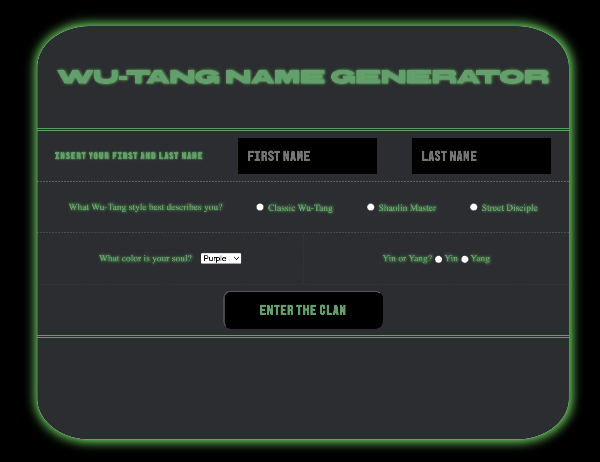

# Wu-Tang Generator

_This app generates a person's Wu-Tang clan through a questionnaire. The answers are then calculated and sent to the server to send back the name based off of a library held in the server._

<a style="text-align:center" href="https://wu-tang-generator-bootcamp.onrender.com/">Here is the rendered project</a>

 

## How It's Made:

_Tech used: HTML, CSS, JavaScript, Node.js_

Every response is the user gives is given a numerical value and passed into a variable that correlates to the users' first name or last name score. The numbers are then passed to the server, where they are modulo'd against the arrays of first and last names. The response given is based off of the index of the modulated score and sent back to the user.

## Lessons Learned:

I learned about some nifty string and array methods such as <code>.charCodeAt()</code> which is used to return a numerical value based off of the utf-16 encoding system. I also got practice in using a server to store and process information based off of the specific request the user makes.

### More Projects:
<a href="https://github.com/godwinKamau/matching-card">Matching Card Game</a>

<a href="https://github.com/godwinKamau/complex-api">Using APIs to expand my music tastes</a>
